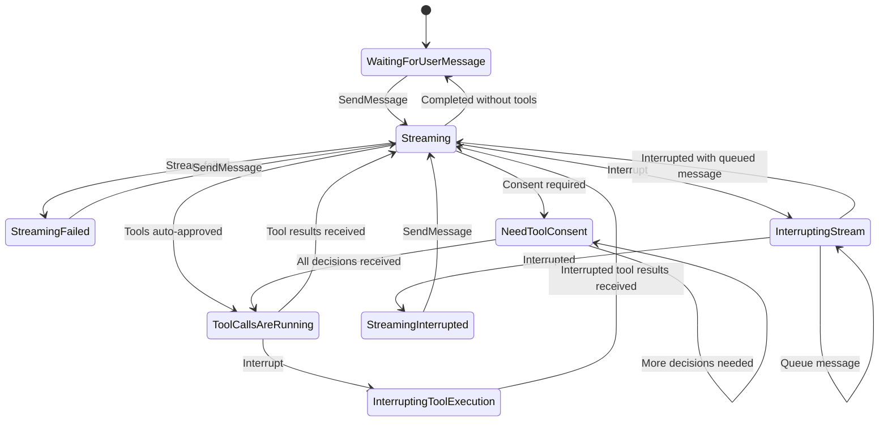

# agent-core

This is the core harness of the agent. It consists of a Session which
starts an OS thread to run the agent, and a SessionHandle which is used to interact
with the session from the outside. The main agent loop and harness lives in here.

## Agent loop

The main agent loop is as follows:

User sends message
-> agent responds with tool calls

->
- User chooses which tool calls to approve/deny (optionally with message)
- Agent auto approves some tool calls if they are safe 

-> harness executes tool calls

-> results of tool calls sent back as messages to model

## Implementation

Auger's core agentic loop is implemented as an event loop
driven by internal events. There are 3 forms of internal events:
1. User commands
2. Results returned by a completed streaming task
3. Results returned by a completed tool execution task

On each event, we simply check the current state of the agent,
and based on the event, decide what the next state the agent
should be in.

