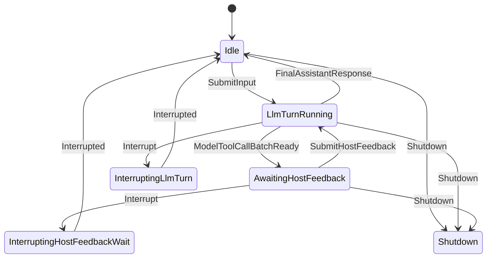

# auger agent loop

`agent-loop` is a small runtime crate for driving an Auger session through user turns, model turns, tool feedback, interrupts, and shutdown.
It keeps provider conversation state separate from runtime control flow, so the loop can preserve legal message ordering while still handling partial responses and aborted work.
The session starts idle, streams model responses when input or tool feedback is submitted, and waits for host feedback whenever the model requests tools.
Interrupts either abandon or commit partial model output, or mark pending tool calls as aborted when the next user message arrives.

